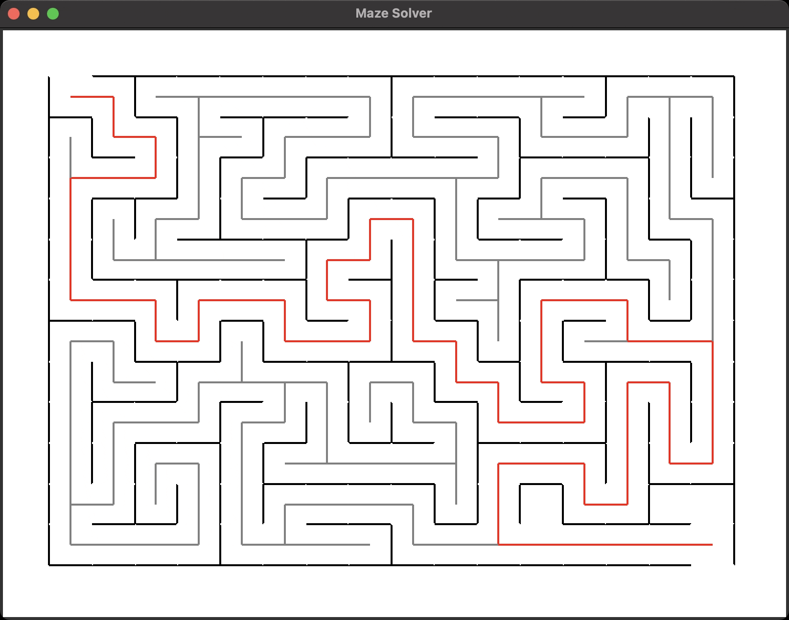

# Maze Solver

This is a simple maze solver application using recursion and graphical user interface (GUI) built with Python's `tkinter` library. The maze is generated randomly, and a path is found from the start to the goal using a depth-first search algorithm.

## Features

- Random maze generation
- Visualization of the maze and solution path
- Recursive solution search for the path

## Requirements

- Python 3.x
- tkinter (typically included with Python standard library)

## How to Run

1. Make sure Python 3.x is installed on your system.
2. Clone or download the project files.
3. Run the `maze_solver.py` script.

```bash
python maze_solver.py


